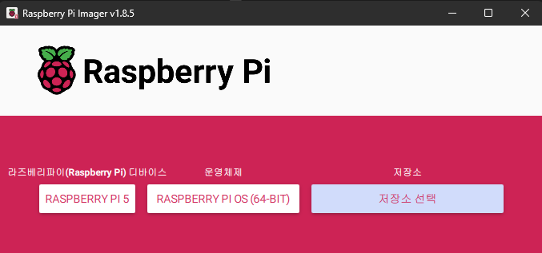
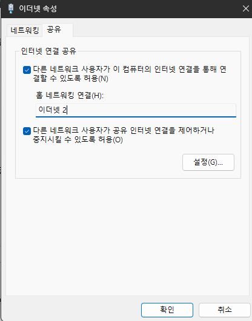
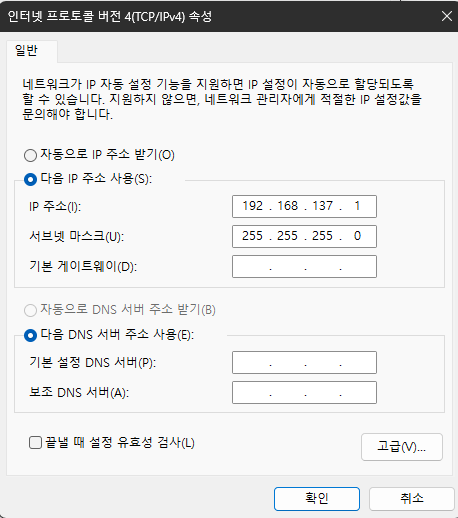
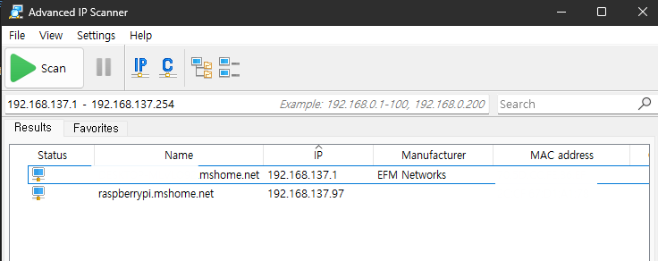

Raspberry Pi CM5 를 처음 부팅하고, eMMC에 OS 설치 후 Windows PC와 Ethernet을 통해 SSH로 접속하기까지의 과정

## 1. eMMC 부트 방지 점퍼 제거

- CM5의 eMMC는 기본적으로 부팅을 방지하기 위해 점퍼로 설정됨
- Raspberry Pi Imager로 OS를 설치한 후에는 점퍼를 제거해야 정상 부팅 및 HDMI 출력이 가능

## 2. rpiboot 설치 및 Mass Storage 모드 진입
PC에서 라즈베리파이의 eMMC를 장치로 인식하기 위해 rpiboot를 설치
rpiboot는 라즈베리파이를 PC에서 인식하고 사용할 수 있게 함(일종의 디바이스 드라이버 프로그램)

- [**rpiboot**](https://github.com/raspberrypi/usbboot/raw/master/win32/rpiboot_setup.exe) 설치
- CM5를 PC에 USB로 연결한 후, `rpiboot-CM4-CM5 - Mass Storage Gadget`을 실행하면 eMMC가 USB Mass Storage 디바이스로 인식됨

## 3. Raspberry Pi OS 설치

Raspberry Pi OS 64bit 설치

- [**Raspberry Pi Imager**](https://www.raspberrypi.com/software/) 설치 및 실행
- **Raspberry Pi OS 64bit** 선택 후 설치
- **MMC/BLK0 USB DEVICE** 선택



설치가 완료되면 **점퍼를 제거**한 뒤 재부팅하고, HDMI를 통해 화면이 정상 출력되는지 확인

## 4. Ethernet 직접 연결 설정 (Windows PC 기준)

CM5를 **USB-Ethernet 어댑터**를 통해 **Windows PC에 직접 연결**

### 1) 제어판에서 ICS 설정

Windows에서 기존 인터넷 연결 어댑터에 대해 **인터넷 연결 공유(ICS)**를 설정 → Ethernet을 통해 라즈베리파이에 네트워크를 전달



### 2) Raspberry Pi 어댑터 설정



라즈베리파이에는 자동으로 **192.168.137.xxx** 대역의 IP가 할당됨

## 5. IP 확인 및 SSH 접속

### IP 확인 툴

- [Advanced IP Scanner](https://www.advanced-ip-scanner.com/) 사용 시, 라즈베리파이의 IP를 확인 가능  
- 또는 `raspberrypi.mshome.net`이라는 도메인으로 자동 할당됨



### SSH 접속 (Key 인증 기반)

```bash
ssh terry@raspberrypi.mshome.net
````

또는

```bash
ssh pi@192.168.137.xxx
```

> *Note: 기본 사용자명은 `pi`입니다. 별도로 계정을 만들었다면 그 계정을 사용*

---

## 6. SSH 설정 변경 (선택 사항)

SSH 설정을 직접 편집하려면 다음 명령을 수행:

```bash
sudo apt-get update
sudo apt-get install vim
sudo vim /etc/ssh/sshd_config
sudo systemctl restart ssh
```

필요한 설정:

* `PermitRootLogin no`
* `PasswordAuthentication no` (Key 인증만 사용 시)